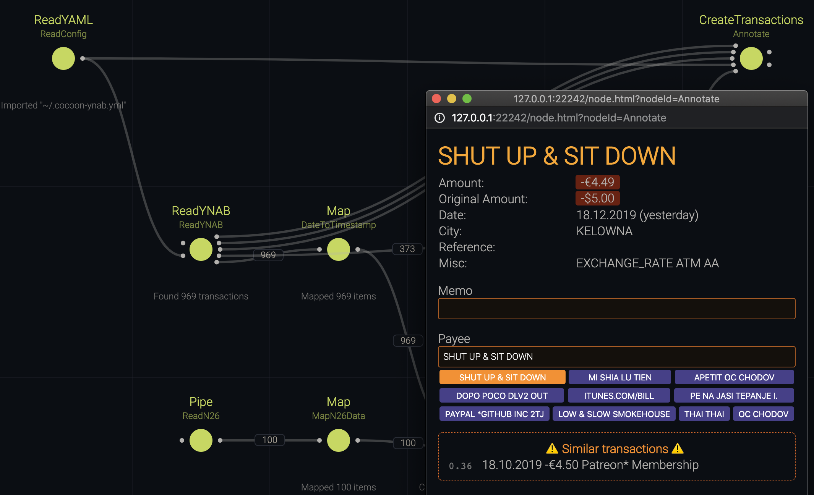

# cocoon-ynab

This project uses [Cocoon](https://github.com/aengl/cocoon-demo) to create a visual environment for importing bank statements from [N26](https://n26.com/) to [YNAB](https://www.youneedabudget.com/), though it can be easily adjusted to import from other banks as well.



## Installation

Requires [Node.js](https://nodejs.org/) >= 12 and [Python](https://www.python.org/) >= 3.6.

Recommended: [yarn](https://yarnpkg.com/)

```
yarn install
pip3 install n26
cp n26.yml.example n26.yml
```

Then open the `n26.yml` and fill in the blanks. It contains more than just the configuration for N26, but [python-n26](https://github.com/femueller/python-n26) requires the file to have that name.

## Usage

Start the editor using:

```
yarn editor
```

If you configured everything correctly, run all the nodes and open the view for the transaction node. Then, have fun approving transactions!

If you have no idea how the editor works, please consult the [Cocoon demos](https://github.com/aengl/cocoon-demo) for an in-depth explanation.
